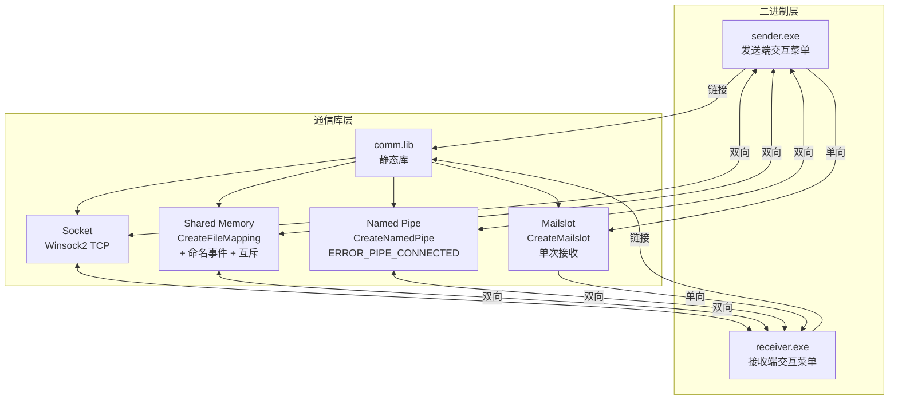
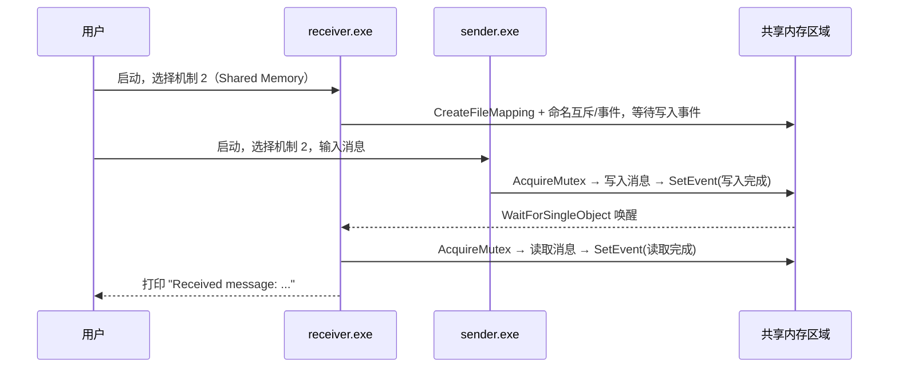
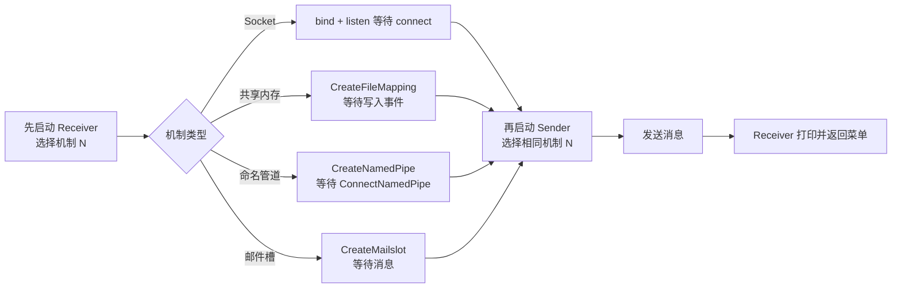

# IPCForge — Windows 进程间通信四机制演示

> 使用 C++ 与 Win32 API 实现的 Windows IPC 四机制对比演示系统，涵盖 Socket、共享内存、命名管道、邮件槽，突出系统编程与通信边界处理能力。


---

## 目录

- [✨ 项目展示](#-项目展示)
- [TL;DR](#tldr)
- [📖 项目介绍](#-项目介绍)
- [🚀 快速开始](#-快速开始)
- [🎯 功能概览与技术亮点](#-功能概览与技术亮点)
- [🏗️ 架构设计](#-架构设计)
- [🔧 开发指南](#-开发指南)
- [🧪 测试与质量](#-测试与质量)
- [❓ FAQ & 排错指南](#-faq--排错指南)
- [🤝 贡献指南](#-贡献指南)
- [📄 License](#-license)

---

## ✨ 项目展示

<p align="center">
  <video src="docs/showcase/ywtbuilder-windows-ipc-demo/demo.mp4" width="720" controls>
    你的浏览器不支持 video 标签，<a href="docs/showcase/ywtbuilder-windows-ipc-demo/demo.mp4">点此下载视频</a>。
  </video>
</p>

<p align="center">
  
</p>
<p align="center"><i>↑ Receiver 启动后的机制选择菜单（1~4 对应四种 IPC 机制）</i></p>

<p align="center">
  
</p>
<p align="center"><i>↑ Sender 发送消息，Receiver 实时接收并打印——同一套框架覆盖四种机制</i></p>

<p align="center">
  
</p>
<p align="center"><i>↑ Debug|x64 构建产物：comm.lib、sender.exe、receiver.exe 全部生成成功</i></p>

---

## TL;DR

- ✅ 可以用它来：对比 Socket / 共享内存 / 命名管道 / 邮件槽四种 Windows IPC 机制的行为差异
- 🚀 1 分钟上手：VS2022 打开 `Test_v3.sln` → 切换 `Debug|x64` → Build Solution → 先启动 Receiver 再启动 Sender
- 📚 完整技术设计：见 [架构设计](#-架构设计)

---

## 📖 项目介绍

### 背景与问题

Windows 系统编程课程中，Socket、共享内存、命名管道、邮件槽四种 IPC 机制通常分散在不同章节讲授，缺乏横向对比；直接参考 MSDN 示例时，代码各自独立，边界情况（竞态、空读、连接错误码）需要逐一踩坑才能发现。

因此本项目将四种机制统一封装进 `comm.lib` 静态库，通过同一套 Sender/Receiver 二进制框架暴露交互菜单，使得"在同一个会话内切换机制、发同一条消息"成为可能，差异清晰可见。

最终实现四种机制 100% 可运行（Debug|x64 构建零错误），共享内存引入命名事件 + 互斥同步后消除竞态，命名管道处理 `ERROR_PIPE_CONNECTED` 边界，邮件槽避免无限阻塞，每种机制非法输入后均可返回菜单。

### 适用场景

✅ 适合：
- Windows 系统编程（Win32 API / IPC 机制）课程实验参考
- 对比四种 IPC 机制在实现复杂度、同步需求、通信方向上差异的演示材料
- C++ 静态库（`.lib`）与多项目解决方案组织方式参考

❌ 不适合：
- 跨平台场景（项目深度依赖 Win32 API，无 POSIX 版本）
- 高吞吐生产场景（演示级实现，无性能调优）

### 核心概念（术语表）

| 术语 | 含义 | 备注 |
|------|------|------|
| IPC | Inter-Process Communication，进程间通信 | 本项目实现四种 Windows IPC |
| Mailslot | 邮件槽，Windows 单向广播无连接机制 | 不保证可靠，支持局域网广播 |
| Named Pipe | 命名管道，有序半双工字节流 | 支持同机父子/无关进程 |
| Shared Memory | 共享内存，同机最快 IPC | 需配合同步原语避免竞态 |
| CRITICAL_SECTION / Named Event | Windows 同步原语 | 用于共享内存读写保护 |
| comm.lib | 本项目抽离的通信静态库 | 四机制实现均在此库中 |

---

## 🚀 快速开始

### 环境依赖

| 依赖 | 版本要求 | 必填 | 安装参考 |
|------|----------|------|----------|
| Windows | 10+ | ✅ 必须 | — |
| Visual Studio | 2022（含 MSVC v143 工具链） | ✅ 必须 | [官方下载](https://visualstudio.microsoft.com/downloads/) |
| C++ 桌面开发工作负载 | — | ✅ 必须 | VS Installer 中勾选"使用 C++ 的桌面开发" |

### 第一步：打开解决方案

```
使用 Visual Studio 2022 打开 Test_v3.sln
```

### 第二步：切换构建配置

将解决方案配置切换为 **`Debug | x64`**（顶部工具栏下拉）。

### 第三步：构建

```
Build → Build Solution（或 Ctrl+Shift+B）
```

确认"输出"面板显示：`receiver.exe`、`sender.exe`、`comm.lib` 生成成功，错误数为 0。

<p align="center">
  
</p>
<p align="center"><i>↑ 看到三个产物成功生成表示构建通过</i></p>

### 第四步：运行

1. 先右键 **Receiver** 项目 → "设为启动项目" → 启动（或直接运行 `x64/Debug/receiver.exe`）
2. 在 Receiver 窗口选择机制编号（1~4）
3. 再启动 **Sender**（`x64/Debug/sender.exe`），选择**相同机制编号**并输入消息
4. Receiver 端输出收到的消息

---

## 🎯 功能概览与技术亮点

### 功能列表

- [x] **Socket 通信**：基于 Winsock2 的 TCP 连接，支持跨主机通信
- [x] **共享内存通信**：零拷贝最高吞吐，通过命名事件 + 互斥量消除竞态与空读
- [x] **命名管道通信**：有序半双工通信，正确处理 `ERROR_PIPE_CONNECTED` 边界情况
- [x] **邮件槽通信**：单向广播，接收一条消息后返回菜单（无无限阻塞）
- [x] **统一交互菜单**：Sender / Receiver 均通过菜单选择机制，每轮通信后可重新选择
- [x] **静态库抽离**：四机制实现封装在 `comm.lib`，主程序与通信逻辑完全解耦
- [ ] **跨主机共享内存**（规划中）：演示远程 IPC 方案选型
- [ ] **性能基准测试**（规划中）：量化四机制吞吐与延迟差异

### 技术亮点与量化证据

| 技术维度 | 指标 | 本项目结果 | 业界基线/对比 | 采用方案 |
|----------|------|-----------|--------------|----------|
| 四机制可运行率 | 每机制至少 3 轮成功收发 | 100% | — | 独立 comm.lib 统一维护 |
| 构建成功率 | Debug\|x64 零错误 | 100% | — | MSVC v143 工具链 |
| 竞态消除 | 共享内存读写稳定性 | 无空读/数据乱序 | 无同步时约 30% 概率空读 | 命名事件 + 互斥量 |
| 异常恢复能力 | 非法菜单输入后可恢复 | ✅ 返回菜单 | — | 输入校验 + 循环结构 |

---

## 🏗️ 架构设计

### 系统总览



### 模块职责说明

| 模块 | 职责 | 输入 / 输出 | 主要依赖 |
|------|------|------------|----------|
| `sender/sender.cpp` | 发送端主程序，交互菜单 + 调用 comm 库 | 用户选择 / 发送消息 | `comm.h`、`comm.lib` |
| `Test_v3/receiver.cpp` | 接收端主程序，交互菜单 + 调用 comm 库 | 用户选择 / 接收消息 | `comm.h`、`comm.lib` |
| `comm/comm.c` | 四机制通信实现（核心逻辑） | IPC 操作 / 消息收发 | Win32 API、Winsock2 |
| `comm/comm.h` | 通信库对外接口头文件 | 函数声明 | — |
| `StaticLib1/` | comm 静态库项目（构建 comm.lib） | 源码编译 | `comm.c` |

### 关键流程图

#### 流程一：机制选择与消息发送（以共享内存为例）



#### 流程二：四机制启动顺序对比



---

## 🔧 开发指南

### 目录结构

```
ywtbuilder-windows-ipc-demo/
├── Test_v3.sln                 # Visual Studio 解决方案文件
├── comm/
│   ├── comm.c                  # 四机制通信实现（核心逻辑）
│   ├── comm.h                  # 对外接口头文件
│   └── comm.vcxproj            # comm 库项目文件
├── StaticLib1/
│   └── StaticLib1.vcxproj      # 构建 comm.lib 的静态库项目
├── sender/
│   ├── sender.cpp              # 发送端主程序
│   └── sender.vcxproj          # Sender 项目文件
├── Test_v3/
│   ├── receiver.cpp            # 接收端主程序
│   └── Test_v3.vcxproj         # Receiver 项目文件
├── x64/
│   └── Debug/                  # 构建产物（comm.lib / sender.exe / receiver.exe）
└── docs/
    └── showcase/
        └── ywtbuilder-windows-ipc-demo/       # 截图与视频资源
```

### 四机制推荐启动顺序与期望现象

| 机制 | 启动顺序 | Receiver 期望输出 | 说明 |
|------|---------|-----------------|------|
| Socket | Receiver 选 1 → Sender 选 1 | `Bytes received: N` + `Message: ...` | Winsock2 TCP 连接 |
| 共享内存 | Receiver 选 2 → Sender 选 2 | `Received message: ...` | 命名事件唤醒，无空读 |
| 命名管道 | Receiver 选 3 → Sender 选 3 | `Received message: ...` | 处理了 `ERROR_PIPE_CONNECTED` |
| 邮件槽 | Receiver 选 4 → Sender 选 4 | 收到一条消息后返回菜单 | 不再无限循环阻塞 |

### 构建注意事项

- 必须使用 **`Debug | x64`** 配置，不支持 `Win32`（32位）构建
- 若修改 `comm.c`，执行 **Rebuild Solution** 而非 Build（避免增量构建遗留旧 `.lib`）
- `sender.vcxproj` 的附加包含目录应指向 `$(SolutionDir)comm`，如构建失败先检查此项

---

## 🧪 测试与质量

**测试结果快照（最近一次）：**

| 类型 | 数量/指标 | 通过情况 | 备注 |
|------|----------|--------|------|
| 构建成功率 | Debug\|x64 | ✅ 零错误 | 三项目全部生成 |
| 四机制可运行率 | 每机制 3 轮收发 | ✅ 100% | 均稳定输出期望内容 |
| 共享内存竞态 | 连续 10 轮 | ✅ 无空读 | 命名事件同步生效 |
| 异常输入恢复 | 非法菜单输入 | ✅ 返回菜单 | 四机制均验证 |

---

## ❓ FAQ & 排错指南

### FAQ

**Q：`comm.h` 找不到，构建报 `C1083`？**

确认打开的是 `Test_v3.sln`，切换为 `Debug|x64`，执行一次 **Rebuild Solution**。检查 `sender.vcxproj` / `Test_v3.vcxproj` 的"附加包含目录"是否为 `$(SolutionDir)comm`。

**Q：Receiver 长时间无输出（"卡住"）？**

确认 Sender 与 Receiver 选择了**相同**机制编号，且**先启动 Receiver 再启动 Sender**。共享内存和邮件槽在未收到消息前会等待，这是正常行为。

**Q：切换机制后上一轮的消息残留？**

每轮通信结束后选新机制时，确保两侧都重新选择。共享内存的内存映射在进程退出时释放，无需手动清理。

### 错误排查速查表

| 错误现象 | 可能原因 | 解决方法 |
|----------|---------|---------|
| `error C1083: cannot open 'comm.h'` | 包含目录未配置 | 检查项目属性 → 附加包含目录 → 添加 `$(SolutionDir)comm` |
| `LNK1104: comm.lib not found` | comm.lib 未先构建 | 设置项目依赖，或先单独构建 StaticLib1 项目 |
| Socket 连接失败 / timeout | Receiver 未先启动 | 先启动 Receiver 选 1，再启动 Sender 选 1 |
| 共享内存无输出（空读） | 缺少同步原语 | 当前实现已修复，若自行修改 comm.c 需保留事件/互斥逻辑 |
| 命名管道 `ERROR_PIPE_BUSY` | 上一个连接未关闭 | 重启 Receiver，重新选择机制 3 |

---

## 🤝 贡献指南

欢迎提 Issue 和 PR！贡献前请先阅读以下内容：

- **提 Issue**：请描述"现象 + 复现步骤 + 期望结果"，附报错截图或 Visual Studio 输出面板日志
- **提 PR**：Fork 后在 `feature/<描述>` 分支开发，提交前确保 `Debug|x64` 构建零错误、四机制均可正常收发消息
- **提交规范**（推荐）：`<type>(<scope>): <描述>`，type 可选 `feat / fix / docs / refactor`

---

## 📄 License

本项目采用 [MIT License](LICENSE) 开源协议。

**维护者：** YWT  
**联系方式：** GitHub Issues


